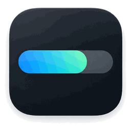

<p align="center">
  
</p>

<h1 align="center">UsageBar</h1>

<p align="center"><strong>A lightweight native macOS menu bar gauge for keeping an eye on your AI usage limits.</strong></p>

UsageBar keeps your current allowance visible in the macOS menu bar, so you do not have to keep opening account settings just to see how much you have left.

It currently supports ChatGPT/Codex and Claude, with room to add more AI services over time. It is native, lightweight, local-first, and intentionally simple.

## Download

Get the latest build from [GitHub Releases](https://github.com/oaseas/usagebar/releases/latest).

Installation is intentionally simple:

1. Download the Universal macOS ZIP.
2. Unzip it.
3. Move `UsageBar.app` to your Applications folder.
4. Open UsageBar.

The Universal build supports Intel and Apple Silicon Macs and targets macOS 13 or later.

Claude is optional. You can use UsageBar with ChatGPT/Codex only.

### macOS security

The release page clearly states whether a build is Developer ID signed and notarized or ad-hoc signed.

If an ad-hoc build is blocked on first launch, try opening it normally once, then go to **System Settings > Privacy & Security** and use **Open Anyway** for UsageBar. This is Apple's normal manual approval path for software that is not notarized. You should not disable Gatekeeper.

## Why I made this

I made UsageBar because not everyone has unlimited resources.

Some of us genuinely need to keep an eye on our remaining usage, especially before starting a long coding session, research task, or other work that can consume a meaningful part of the available allowance.

Opening settings repeatedly just to check a percentage started to feel unnecessary. I wanted something quieter and simpler: a small gauge that stays visible when I need it and gets out of the way when I do not.

Heavy users are very much welcome too. I actually like the idea that something made to solve a small personal annoyance might also be useful to people who use these tools all day.

UsageBar is also my first public software project. I have had a GitHub account for a while, but this is the first time I am releasing something I made for anyone to use. I am genuinely glad to finally contribute something back, even if it started as a small tool I wanted for myself.

If it happens to be useful to you too, that already makes publishing it worthwhile.

## What it does

UsageBar puts a horizontal usage gauge directly in the macOS menu bar.

For ChatGPT, the default view shows the current 5-hour Codex allowance. Left-click the gauge to switch between the 5-hour and weekly views.

If the weekly allowance reaches zero while the current 5-hour window still has capacity, UsageBar automatically shows the weekly limit so the menu bar reflects the limit that is actually blocking you.

You can also switch the app to Claude and view the latest usage percentages stored locally by Claude Desktop.

## Features

- Native Swift and AppKit macOS app
- No Electron
- No third-party runtime dependencies
- Wide configurable menu bar gauge
- ChatGPT/Codex and optional Claude support
- 5-hour and weekly views
- Left-click to switch usage windows
- Remaining or used percentage display
- 120, 180, 260, and 320 point gauge widths
- Monochrome, blue, or capacity-based color styles
- Configurable display refresh interval
- Working Launch at login support through macOS Service Management
- Optional private local status/control bridge for trusted same-user companion tools
- Mock mode for testing
- No Dock icon

## Where the numbers come from

UsageBar does not estimate your allowance from message counts and it does not make AI model calls.

### ChatGPT

UsageBar reads the **Codex allowance** from the local Codex app server associated with the ChatGPT account already signed in on your Mac.

It displays the 5-hour and weekly Codex windows returned for that account, including reset times when available.

**Important:** this is the Codex allowance. It is not a claim to measure every ChatGPT model, feature, or message cap.

No separate UsageBar account is required.

### Claude

Claude support is optional.

UsageBar reads the percentages Claude Desktop stores locally in its usage history file. This is cached desktop data, not a direct UsageBar server connection.

Claude reset times are not available from this local cache, so UsageBar does not invent them. The app shows the actual sample time and marks old readings as stale.

The Claude cache format is not a public Anthropic API and may change in a future Claude Desktop update.

More technical detail is available in [docs/TECHNICAL.md](docs/TECHNICAL.md).

## Refreshing and resource use

The menu bar can redraw more often than UsageBar actually asks a provider for new data.

For ChatGPT/Codex:

- one persistent local Codex helper is reused instead of launching a new process for every refresh
- ordinary Codex usage reads are cached for 30 seconds
- **Refresh now** bypasses that cache
- overlapping refresh work is prevented
- errors trigger exponential retry backoff up to 60 seconds

For Claude:

- the local history file is only decoded again when its modification time changes
- Claude itself writes new samples less frequently than the fastest UsageBar display interval

This means choosing a 1-second display refresh does not create one new Codex network request per second.

## Launch at login

UsageBar uses Apple's Service Management framework on macOS 13 and later.

For the most reliable setup:

1. Move `UsageBar.app` to your Applications folder first.
2. Open UsageBar.
3. Right-click the gauge and enable **Launch at login**.

macOS may require approval in **System Settings > General > Login Items & Extensions**. UsageBar can open that settings page when approval is needed.

If you move the app after enabling Launch at login, disable and enable the setting again from the app.

## Optional local companion bridge

UsageBar can expose a small local file bridge for trusted same-user companion dashboards such as Endeavor.

The bridge uses:

- `~/Library/Application Support/UsageBar/status.json` for read-only status
- `~/Library/Application Support/UsageBar/command.json` for a small whitelist of local commands

The Application Support directory is restricted to the current user. Status files are written with owner-only permissions. Commands are size-limited, parsed as JSON, and only accepted when their keys and actions match UsageBar's whitelist.

UsageBar does **not** include or publish a private Endeavor dashboard, web server, session token, personal machine path, or private dashboard data.

A companion web dashboard is responsible for its own localhost binding, authentication, and same-origin protections. See [docs/COMPANION_BRIDGE.md](docs/COMPANION_BRIDGE.md).

## How to use it

Once UsageBar is running, the gauge appears directly in the menu bar.

```text
G  5H R  ████████████████░░░░  78%
```

Left-click to switch to weekly usage:

```text
G  7D R  █████░░░░░░░░░░░░░░░  25%
```

Right-click the gauge to access:

- AI service
- Gauge width
- Remaining or used display
- Gauge color
- Data source
- Display refresh interval
- Refresh now
- Launch at login
- About
- Quit

## Privacy

UsageBar is designed as a local utility.

It does not operate a UsageBar server, does not need your ChatGPT or Claude password, and does not read the contents of your conversations.

For ChatGPT, authentication remains with Codex. For Claude, UsageBar reads only the local usage history needed for the gauge.

See [PRIVACY.md](PRIVACY.md) for the full explanation.

## Current limitations

- ChatGPT values currently represent the Codex allowance, not every ChatGPT usage limit.
- Claude values come from an undocumented local cache and can become stale.
- Claude reset times are unavailable from that cache.
- Claude histories containing multiple organization IDs are treated as ambiguous instead of guessing which account to show.
- Launch at login uses macOS Service Management and still depends on user approval where macOS requires it.
- Menu bar placement is controlled by macOS. A very wide gauge may be hidden by long app menus or a display notch.

## Building from source

UsageBar requires macOS 13 or later and Swift 6.

For a normal local build:

```sh
./scripts/build-app.sh
open dist/UsageBar.app
```

Run the logic tests with:

```sh
swift test
```

Build the Universal release candidate with:

```sh
./scripts/build-release.sh
```

## Contributing

UsageBar is my first public software project, so I am learning the open-source side of things as I go.

Suggestions, bug reports, fixes, and improvements are very welcome. You do not need to be a developer to contribute.

One principle I would like to keep as the project grows: UsageBar should remain easy to understand for people who do not consider themselves technical.

That matters more to me than adding features simply because they are possible.

See [CONTRIBUTING.md](CONTRIBUTING.md) if you would like to help.

## Made by

UsageBar is made by **oaseas**. You can find me on [GitHub](https://github.com/oaseas) and [X](https://x.com/oaseas).

## Disclaimer

UsageBar is an independent open-source project. It is not affiliated with, endorsed by, or sponsored by OpenAI or Anthropic.

ChatGPT and OpenAI are trademarks of OpenAI. Claude and Anthropic are trademarks of Anthropic.

## License

UsageBar is available under the MIT License. See [LICENSE](LICENSE).
